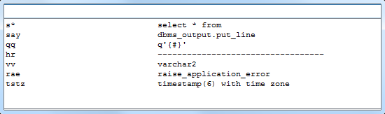

# Autoreplace

Autoreplace is a plug-in for Allround Automations PL/SQL Developer IDE. The plug-in provides functionality similar to Ctrl+J in IntelliJ IDEA.
The plug-in provides a dialog where all entries of PL/SQL Developer autoreplace file are presented for quick access.
This makes easier for developer to use autoreplaces they've configured in PL/SQL Developer's autoreplace file, and especially helpful, if the list is long.

# Building

* Open the solution in Visual Studio.
* Build the solution.

# Installing

Just copy the AutoreplacePlugin.dll to PL/SQL Developer's plug-ins directory and restart the IDE.

# Usage

Plug-in creates an "Autoreplace" menu item under "Tools" menu.

To use plug-in:
1. Configure the keyboard shortcut for Tools > Autoreplace menu item. This can be done in Tools > Preferences.
2. Use the shortcut whenever you're typing something in the editor window &mdash; the dialog with your autoreplaces will appear.
3. Just start typing &mdash; the list of autoreplaces is automatically filtered out. The search is performed on short text and full text.
4. Use up and down arrows to navigate the list. If there is only 1 entry on the list, just hit Enter to use the autoreplace.
5. Press Esc if you've changed your mind, and the dialog will close.
